# Llama Sama 

**Llama Sama** is your quirky quiz buddy — a wise and fuzzy llama on a mission to make learning fun! Powered by AI, the app dishes out short, snappy multiple-choice questions based on your grade and favorite subject. No boring walls of text — just bite-sized brain boosters, llama-style.

## Features

* **Cross-platform mobile app** built with React Native
* **AI-generated questions** using Llama-based models via [Ollama](https://ollama.com)
* **SSE streaming** to deliver questions and feedback in real time
* **Adaptive logic** to avoid repeating previously asked questions

## How It Works

1. A user starts a quiz based on subject and grade level.
2. The backend fetches their session from Redis and prompts the AI with a tailored instruction.
3. The AI returns a question → streamed to the app via SSE.
5. User interacts with the question and receives instant feedback on the UI with red denoting wrong answer and green denoting the right answer.
6. There are 5 questions in total per game and the sessions last for 10 mins.

---
## Getting Started

Follow these steps to run the **Llama Sama** app locally:

1. **Clone the repository**
   ```bash
   git clone https://github.com/Farmaan-Malik/Llama-sama.git
   ```
2. **Install Dependencies**
   ```bash
   npm install
   ```
3. **Run the backend**
   Make sure the [Backend Server](https://github.com/Farmaan-Malik/Llama-backend) is running

4. **Environment Variables**
   Create a `.env` file at the root of your project and define:

   ```env
   EXPO_PUBLIC_BASE_URL='http://<YourServerIP>'
   ```
   
5. **Run the app**
   * For **Android**
     Ensure an Android emulator or physical device is connected, then run:
     ```
     npm run android
     ```
   * For **iOS**
     First install CocoaPods dependencies:
     ```
     cd ios
     pod install
     ```
     Then
     ```
     npm run ios
     ```

---

## Tech Stack

**Mobile App:**

* **React Native** with **TypeScript** — for cross-platform development
* **Expo** — fast development and build tooling
* **Expo Router** — file-based navigation and routing
* **EAS (Expo Application Services)** — for builds and deployment
* **Clean Architecture** — modular, scalable project structure
* **Zustand + MMKV** — for global state management with fast, persistent storage
* **TanStack Query** — efficient and declarative data fetching
* **Axios** — for typed and reusable API requests
* **DiceBear Avatars** — for generating playful user avatars
* **React Native SSE** — to stream questions and metadata in real-time
* **React Native Animated** - for smooth and polished UI animations

---

## The Llama Sama Persona

> "You are Llama-sama — a thoughtful, caring, and wise teacher who believes every student has the potential to shine."

The AI follows a soft, encouraging tone, avoids repetition, and keeps questions direct, factual, and answerable in 1–3 words.
 

## Screens
### Splash & Welcome Screen 
<p>
  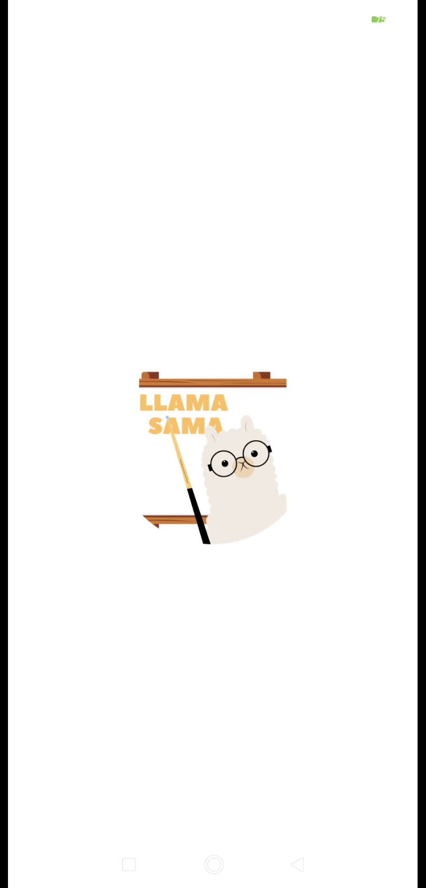
  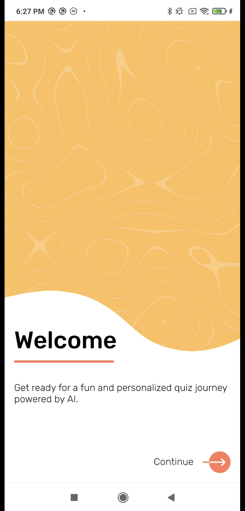
</p>

#### Splash Screen

A brief loading screen shown when the app launches. It handles initial setup tasks like checking stored preferences and authentication state before routing the user to the appropriate screen.

#### Welcome Screen

Displays a friendly introduction for first-time users with a short welcome message. Once the user taps **Continue**, the preference is stored locally using **MMKV**, so the user won't see this screen again on future app launches.


### Login & Signup Screen 
<p>
  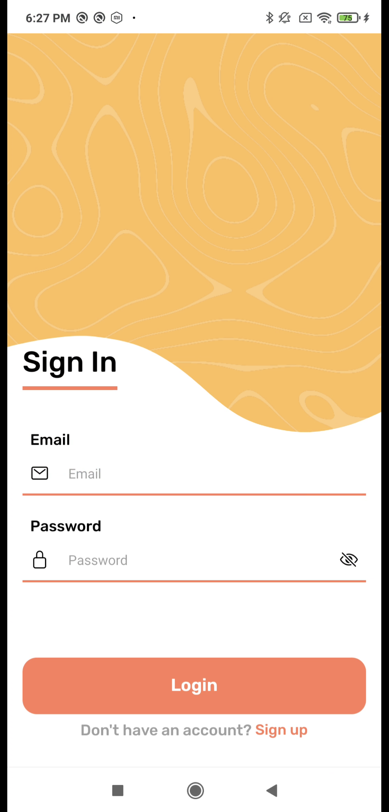
  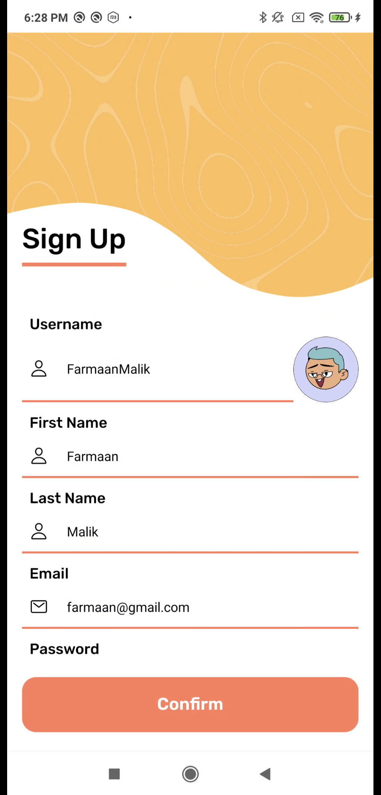
  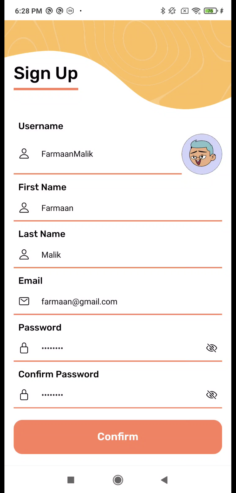
</p>

#### Login Screen

Allows existing users to sign in using their **email** and **password**. Validates input before authenticating the user and navigating them into the app.

#### Signup Screen

Collects user information including **username**, **email**, **first name**, **last name**, **password**, and **confirm password**. The entered username is used as a seed to generate a unique avatar using **DiceBear**, giving each user a personalized visual identity.

### Home Screen 
<p>
  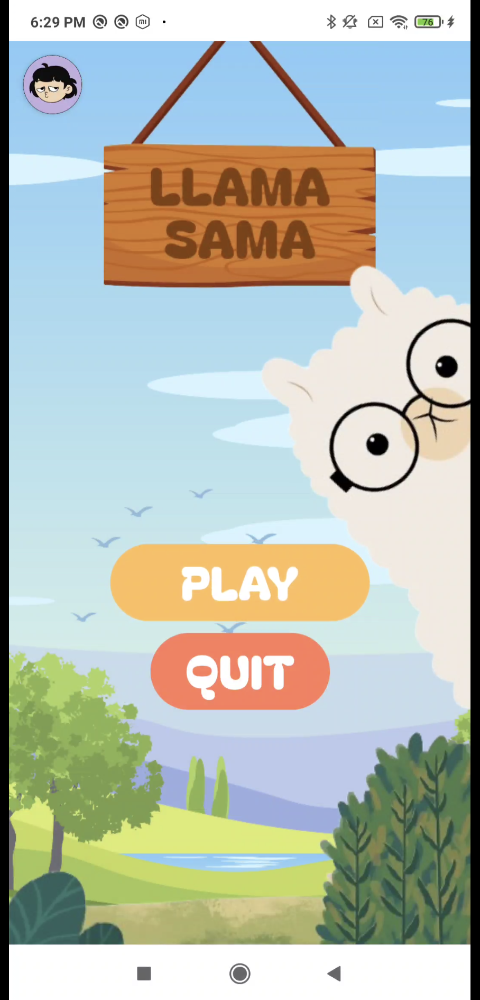
  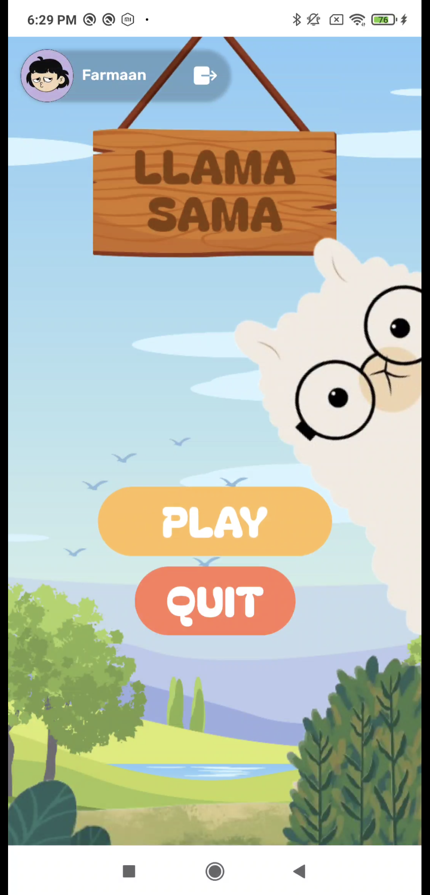
</p>

#### Home Screen

Serves as the main hub of the app with two primary actions: **Play** and **Quit**.  
- **Play** navigates the user to the Options Screen to select their grade and subject.  
- **Quit** exits the app on Android, while on iOS it signs the user out (shown as a **Logout** button).  

The screen also features a circular avatar on the top right, generated via **DiceBear**. Tapping it expands a horizontal panel showing the user’s **username** and a **Logout** option (on iOS).

### Options Screen 
<p>
  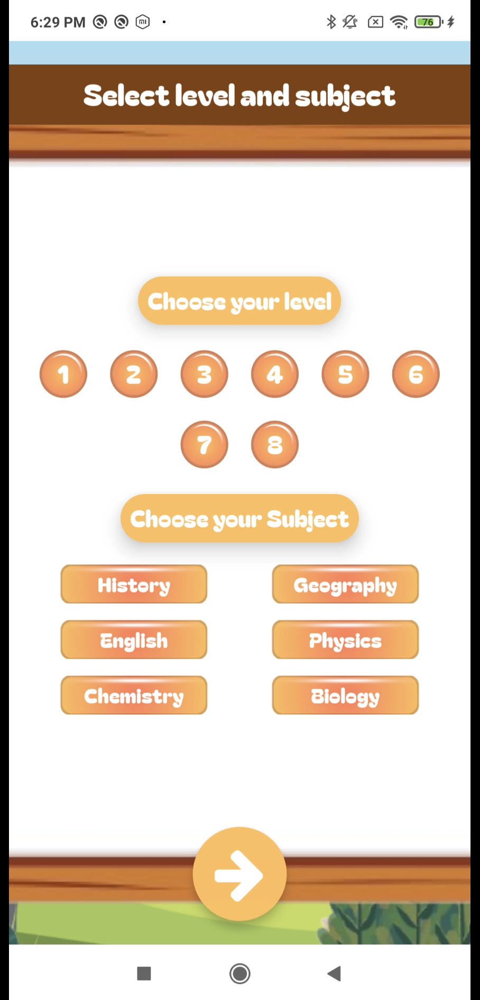
  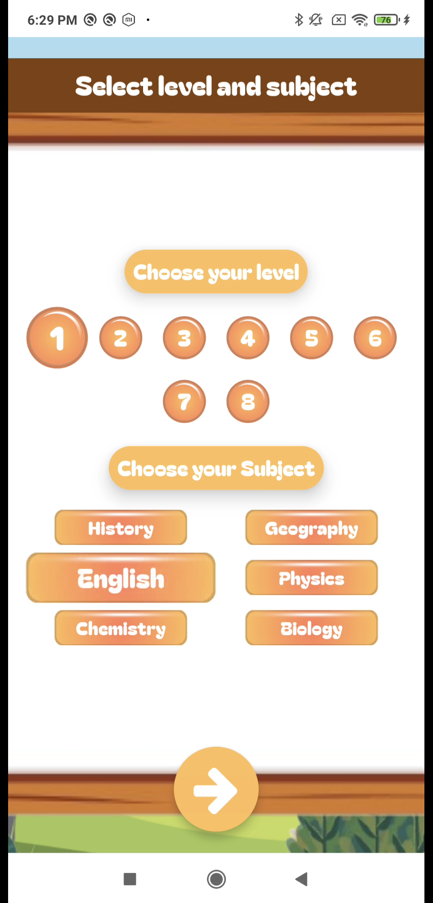
</p>

#### Options Screen

Allows the user to select their **grade level (1–8)** and choose a **subject** from six available options. Both selections are **required** to proceed. Once the user makes a valid selection and taps the arrow button, they are navigated to the **Game Screen** to begin the quiz.


### Game Screen 
<p>
  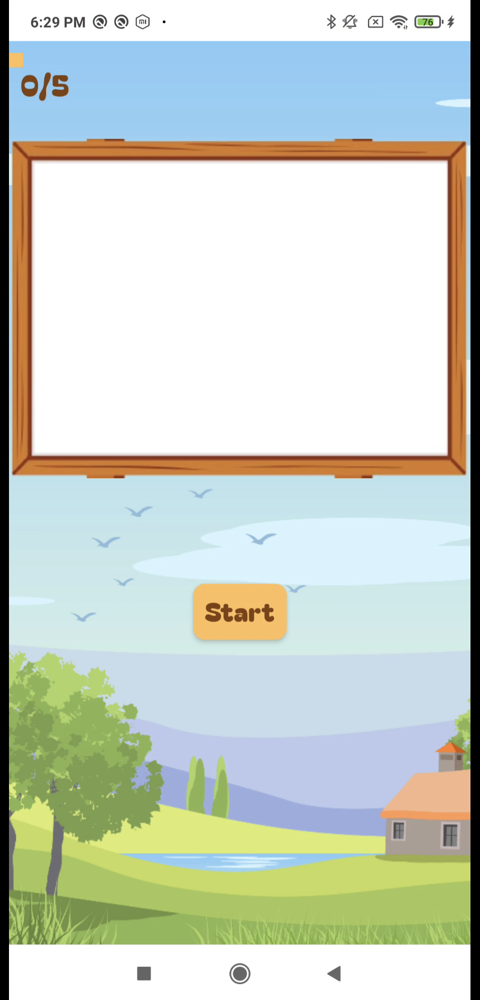
  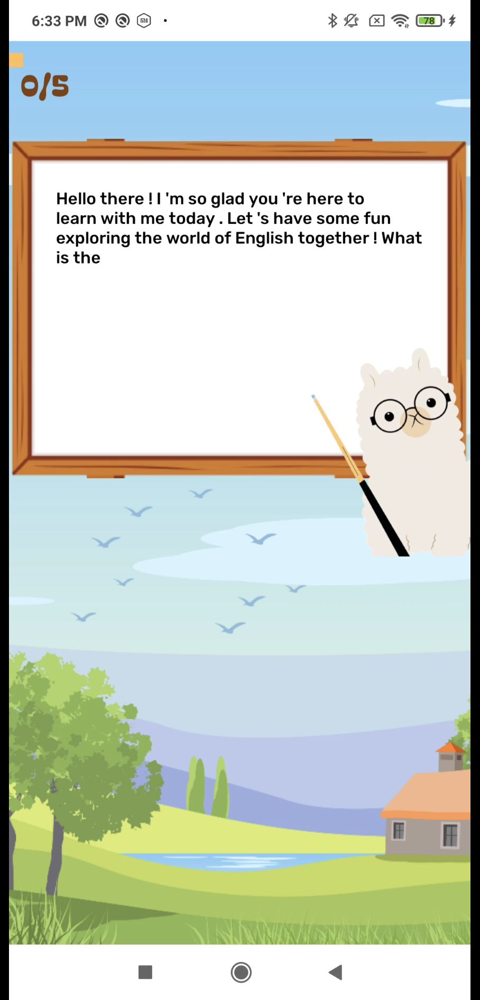
</p>

#### Game Screen

Presents an interactive quiz interface. When the screen loads, a **whiteboard** and **Start** button appear. Pressing **Start** begins the game, triggering a stream of AI-generated questions.

- **Tokens** appear first, followed by **multiple-choice options**.
- The user answers a total of **5 questions**.
- A **question counter** is shown at the top-left corner.
- A **progress bar** expands horizontally as the user advances through the quiz.

<p>
  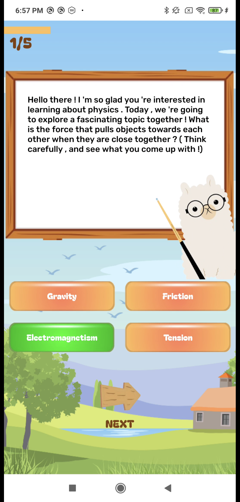
  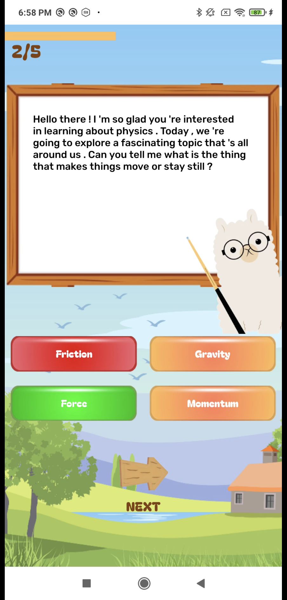
  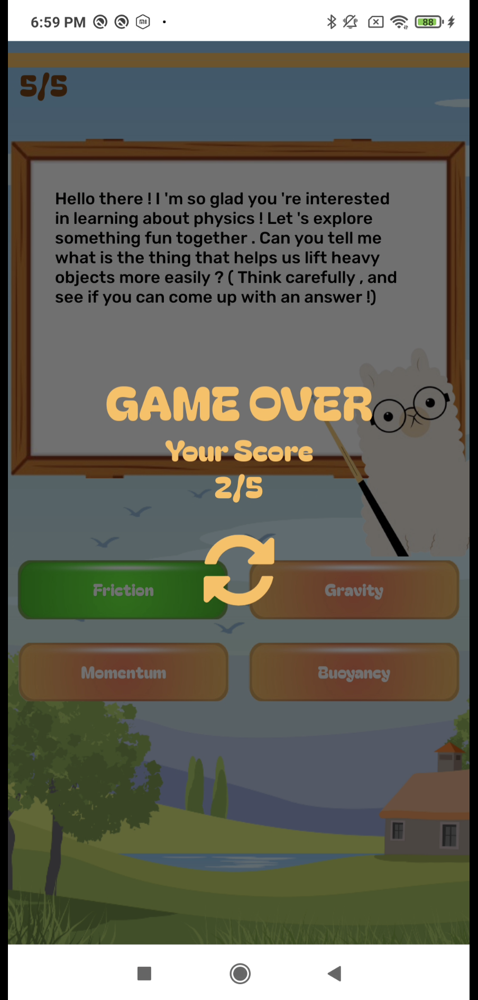
</p>

Each question has **4 options**. When a user selects an option:

- If the answer is **correct**, the selected option turns **green**.
- If the answer is **incorrect**, the selected option turns **red**, and the correct option is also highlighted in **green**, providing immediate feedback.
- After answering, a **Next** button appears at the bottom of the screen. Tapping it loads the **next question**.

After all **5 questions** are answered, a **Game Over modal** appears on top of the game screen displaying:
- A **"Game Over"** message  
- The user’s **score** (e.g., `4/5`)  
- A **Retry** button, which navigates the user back to the **Options Screen** to start a new quiz

